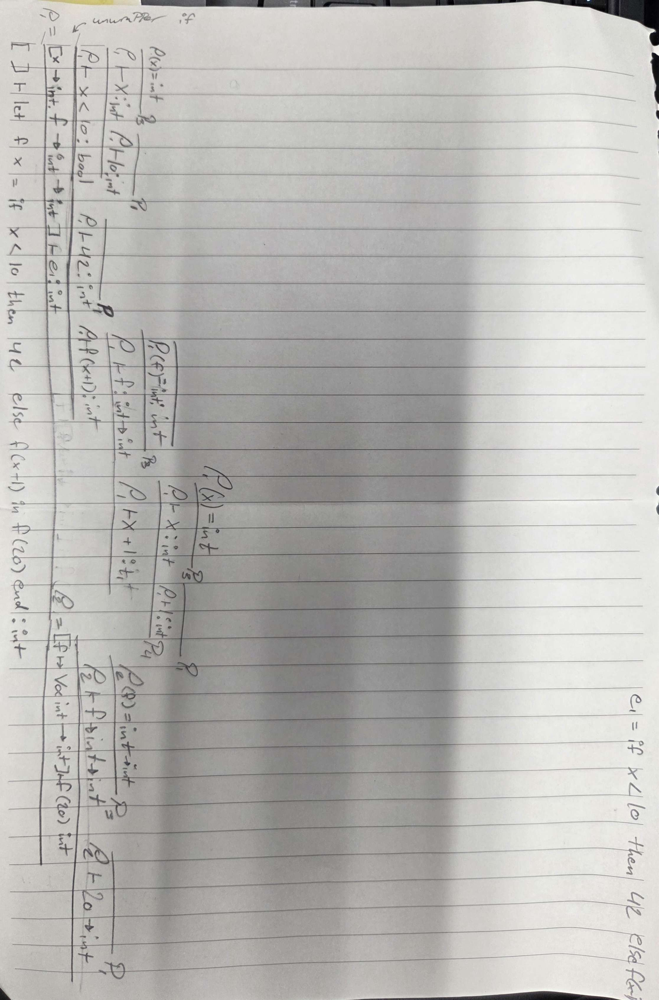

# Assignment 5
## Exercise 6.4
### (i)
The hard to spot $e_1$ in the top right corner reads:
```
e_1 = if x < 10 then 42 else f(x-1)
```


### (ii)
If we have a value with no type, when we've completed the truth tree, the tree must be polymorphic.

Since every type is infered/known in our tree, it must be monomorphic.

## Exercise 6.5