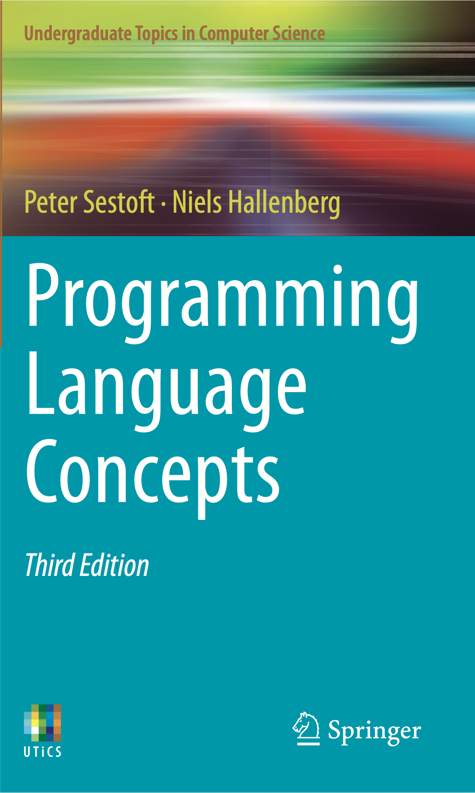

# Programming Language Concepts

## Welcome

Welcome to the repository for the supporting files to the book
Programming Language Concepts (PLC), Third Edition.

The book covers basic concepts such as abstract and concrete syntax;
functional, object oriented and imperative programming languages;
interpretation, stack machines, compilation, type checking, garbage
collection, and real machine code, as well as the more advanced topics
on polymorphic types, type inference using unification, co- and
contravariant types, continuations, and backwards code generation with
on-the-fly peephole optimization. 

The book uses a functional programming language (F#) as metalanguage
to present all concepts and examples, and thus has an operational
flavour, enabling practical experiments and exercises.

Programming Language Concepts covers practical construction of lexers
and parsers, but not regular expressions, automata and grammars, which
are well covered elsewhere. It discusses the design and technology of
Java and C# to strengthen students' understanding of these widely used
languages.

The examples present several interpreters and compilers for toy
languages, including compilers for a small but usable subset of C,
abstract machines, a garbage collector, and ML-style polymorphic type
inference. Each chapter has exercises. Complete example source files,
lecture slides and other materials are available below.

The second edition added a synthesis chapter that presented a full
compiler from micro-SML, a subset of the functional language Standard
ML, to an abstract machine, and a chapter that described a simple
compiler from micro-C to real machine code.  

This third edition adds two new synthesis chapters that describe
micro-Java, a subset of Java, its type checking and its compilation
for an abstract machine. The various abstract machines have been
unified into one, called micro-VM. We have reduced the number of
programming tools and now use only cross-platform tools such as Java,
dotnet, F#, and clang. The chapter on compilation of micro-C to real
machine code now describes and uses the Arm64 architecture instead of
x86, and the neater Arm64 instruction set is used in all machine code
examples.

[Table of contents for the third edition.](./plc3rd/tableofcontents.pdf)

## Code Structure

Each chapter refers to what files and directories are used for the
topic. All code resides in directory
[`plcFSharp`](./plcFSharp/README.md).

## Platform Dependencies

The example code work on Linux, MacOS and Windows platforms, see
[Platform Dependencies](./plcFSharp/README.md)

## Lecture Slides

Some example lecture slides are included as supporting material, see
[Lecture Slides](./plc3rd/slides/README.md)

## Bibliographic data, third edition (2026)
TODO
[Peter Sestoft](https://raspi.itu.dk/~sestoft/), [Niels
      Hallenberg](https://www.linkedin.com/in/nielshallenberg/) :
      Programming Language Concepts, Third edition, [Springer
      Undergraduate Topics in Computer
      Science](http://www.springer.com/series/7592) </a>. The [book's
      page](linklink) at
      Springer.  Front matter and back matter are freely available.

Order it from
[Amazon.de](linklink)
or
[Amazon.co.uk](linklink)
or straight from
[Springer](linklink).

[Errata for the third edition](plc3rd/errata3rd.md).

## Bibliographic data, second edition (2017)

[Peter Sestoft](https://raspi.itu.dk/~sestoft/) :
      Programming Language Concepts, Second edition, with a chapter by
      Niels Hallenberg, [Springer Undergraduate Topics in Computer
      Science](http://www.springer.com/series/7592) </a> xv + 341
      pages.  ISBN 978-3-319-60788-7. September 2017. The [book's
      page]( http://www.springer.com/gp/book/9783319607887) at
      Springer.  Front matter and back matter are freely available.

Order it from
[Amazon.com](https://www.amazon.com/Programming-Language-Concepts-Undergraduate-Computer-ebook/dp/B075BGDD4P)
or
[Amazon.de](https://www.amazon.de/Programming-Language-Concepts-Undergraduate-Computer/dp/331960788X)
or straight from
[Springer](http://www.springer.com/gp/book/9783319607887).

## Bibliographic data, first edition (2012)

[Peter Sestoft](https://raspi.itu.dk/~sestoft/) :
    Programming Language Concepts, [Springer Undergraduate Topics in
    Computer Science](http://www.springer.com/series/7592). xiv + 278
    pages.  ISBN 978-1-4471-4155-6. July 2012. The [book's
    page](http://www.springer.com/computer/swe/book/978-1-4471-4155-6)
    at Springer. Front matter and back matter is freely available.

